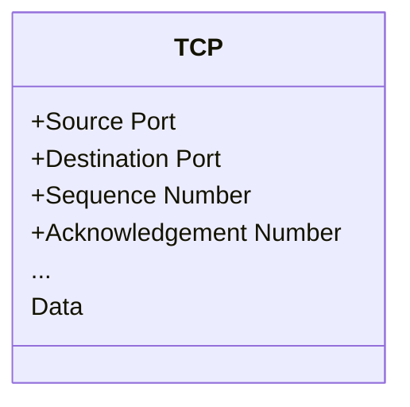
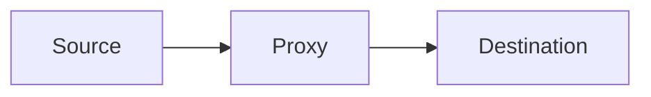
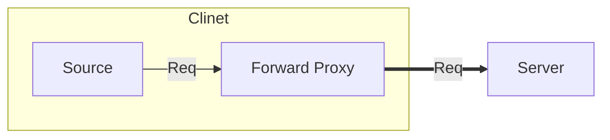
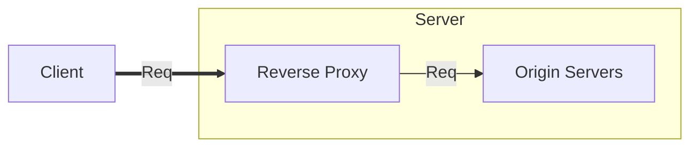
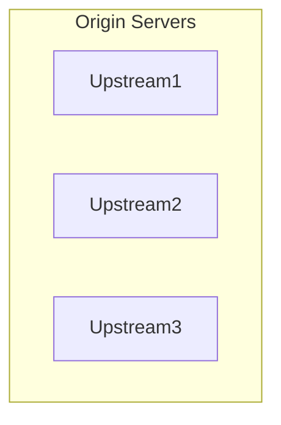

# 說文解字 - 反向代理伺服器

## 講者： Jeff

## 伺服器

 一言以蔽之，接收請求（Request）並產生回應（Response）的機器，以現在我們常稱的伺服器大致上都是基於四層的 TCP / UDP 上的。

 例如常見七層服務的 HTTP、SMTP、FTP 或是 DNS 等等。

### 基於 TCP？

第七層的內容會放置在第四層的內容中的一部分



如果這個 TCP 的 Data 是一個 HTTP 請求的話

TCP Data => HTTP Content

```http
GET /foo HTTP/1.1
Host: jeff.com:443

{ "msg": "hell world!"}
```

> BUT `HTTP3` IS A GAME CHANGER. `HTTP3` (QUIC) USES UDP.

## 代理伺服器

代理伺服器 (Proxy) 代理一個伺服器該做的事情



所以代理伺服器也是一種伺服器

換句話說，同樣可以處理基於四層的 Request

## 正向代理伺服器



## 反向代理伺服器



- Origin Servers (Upstream、Backend、源站):



- Proxy the request back to the origin server (回源)

將 Request 再傳送給源站

### 保護源站

1. 對於發出 request 的 Client 來說，源站的 IP 位置是不可知的
2. Reverse Proxy 決定是否要回源，藉此提前丟棄非法或惡意的流量

### 內容快取

對於靜態資料可選擇於反向伺服器中設定快取，那就可以減少源站的請求

這也是 CDN 基於反向代理伺服器的應用案例之一

### 負載均衡

反向代理伺服器又可以當成網關 (Gateway) 並用來負載均衡多個源站

## 總結

反向代理伺服器本質還是一個伺服器，但通常不直接處理請求，而是作為一個對外的伺服器來統一收集請求

使用反向代理伺服器可以更加彈性的配置真實的伺服器，而 Gateway 或是 CDN 都是一種反向代理伺服器的應用