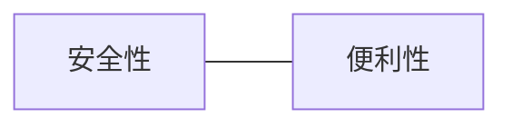

# 你不需要密碼 - Fast IDentity Online

## 講者： Jeff

現在，你需要申請會員，請輸入你的帳號密碼

注意: 密碼必須包含大小寫字母、數字、特殊符號，且長度必須大於 8 個字元。每三個月變更一次密碼，且不可與前三次的密碼相同。

MDFK.

## 密碼機制的困境

1. 密碼的安全性與使用者的行為有關，但使用者的行為是無法控制的。
2. 密碼驗證的是 ID 而不是使用者的身份。
3. 密碼考驗的是使用者的記憶力，而不是使用者的身份。

> 聽過釣魚網站吧，魚兒們。

## 日趨複雜的密碼機制，還是密碼

1. 增加複雜度與長度
2. 增加變更頻率
3. 增加變異性
4. 安全提示問題
5. SSO / OAuth

## 密碼的安全性

2 Factor Authentication (2FA) / one-time password (OTP)

> 在現代的密碼機制下，2FA 幾乎是必要的

## 資安是光譜

## Fast Identity Online (FIDO)

FIDO 的目標是提供更安全、更便利的身份驗證機制，取代傳統的使用密碼進行身份驗證的方式。

- 2012: FIDO Alliance
- 2013: iPhone 5s
- 2014: UAF/U2F
  - UAF: 生物特徵
  - U2F: 硬體金鑰
- 2018: FIDO2 WebAuthn/CTAP
  - WebAuthn: 網頁 API
  - CTAP: 裝置 API
- 2019: W3C WebAuthn
- 2020: Platform and browser support (WebAuthn)

## WebAuthn API

允許使用者使用不同的驗證器進行身份驗證

## Client to Authenticator Protocol (CTAP)

WebAuthn API 透過 CTAP 與驗證器溝通

## Basic Register Flow

1. Client: create a new credential
  - Relying Party: ID (e.g. skycloud.com.tw)
  - User: ID
  - Authenticator: ID
2. Client: send credential to authenticator
  - WebAuthn API with CTAP
3. Authenticator: create a new credential
  - Phone: fingerprint
4. Authenticator: return credential to client
5. Client: send credential to server
6. Server: store credential

## Basic Authentication Flow

1. Client: send credential to server
2. Server: send challenge to client
3. Client: send challenge to authenticator
4. Authenticator: verify credential
5. Authenticator: return assertion to client
6. Client: send assertion to server
7. Server: verify assertion

## 全都是密碼

## Passkeys

**你不需要密碼，而是密碼需要你**

> SSH key: credential

1. 不再有字面上意義的密碼，使用者只需要證明自己
2. 不可視的密碼儲存在那些能認證使用者的裝置中
3. 密碼是唯一的，但證明自己的方式卻是多樣的
4. 在便利性與安全性中取得平衡

[Passkey DEMO](https://www.passkeys.io/)

> One more thing...
> WEB 3.0: Decentralized Identity (DID)